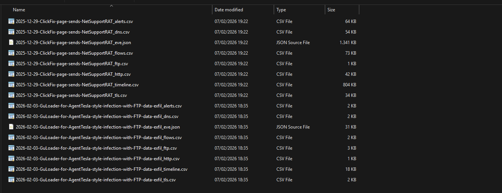
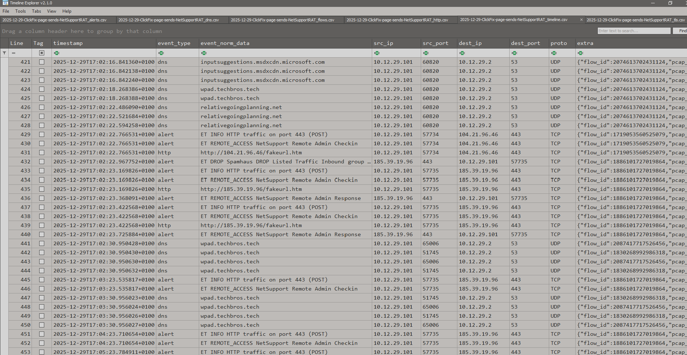
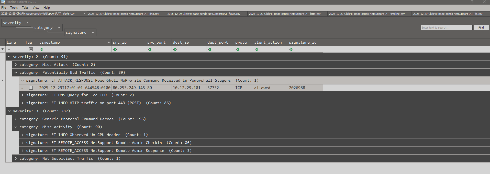

# pcap2csv — Convert PCAPs into Analysis‑Ready CSVs

`pcap2csv` is a lightweight shell script wrapper around suricata that transforms raw packet captures into structured CSV datasets using Suricata’s `eve.json` output. It’s built for fast triage: a common workflow is to run the script from WSL on your forensic workstation, then review the resulting CSVs in [Eric Zimmerman's Timeline Explorer](https://ericzimmerman.github.io/#!index.md) for fast filtering and pivoting.

## Features

- Runs Suricata on PCAP files to extract alerts, HTTP, DNS, TLS, FTP events, and connection flows.
- Converts Suricata’s EVE JSON logs into multiple CSV files, one per event type.
- Generates a chronologically sorted timeline CSV combining all event types.
- Supports custom Suricata rules for tailored detection.
- Fully POSIX-compliant, portable across Linux, macOS, and WSL.
- Minimal dependencies: only suricata and jq required.

## Installation

Install dependencies:

```
sudo apt install suricata jq       # Debian/Ubuntu
sudo suricata-update
```

Clone repository:
```
git clone https://github.com/mf1d3l/pcap2csv.git
cd pcap2csv
chmod +x pcap2csv.sh
```

### Usage

```
./pcap2csv.sh <input.pcap> [-R <rules-file.rules>]
```

#### Options

<input.pcap> : Input PCAP file (required)

-R <rules-file.rules> : Optional Suricata rules file

-h : Display help

#### Output

All output is written to: `pcap2csv_output/`



Given `capture.pcap`, the script produces the following:

- capture_alerts.csv – Suricata alerts
- capture_dns.csv – DNS queries/responses
- capture_http.csv – HTTP request/response metadata
- capture_tls.csv – TLS/SNI, certificate info
- capture_ftp.csv – FTP commands/transfers
- capture_flows.csv – Connection statistics
- capture_timeline.csv – Chronologically merged events





Dataset in the demo screenshots has been generated out of pcaps distributed from https://www.malware-traffic-analysis.net/
